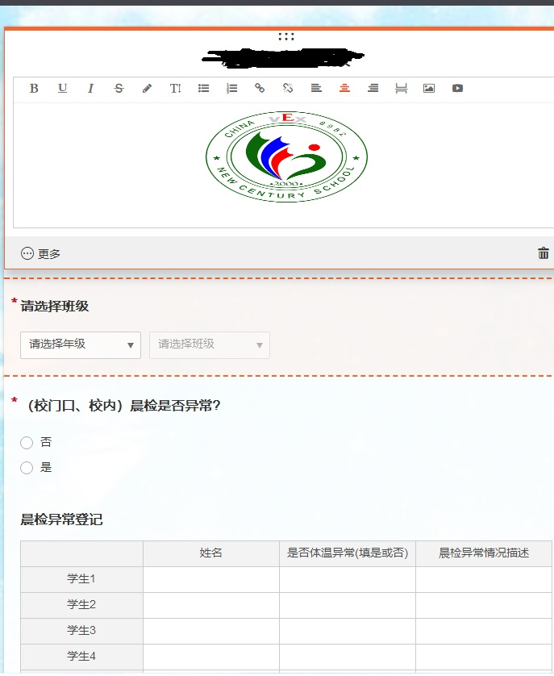

# 疫情期间 excel 分类统计自动化

为了帮助广大老师简化工作流程,特地学了几天的 PYTHON,水平不高,多多包涵
范例数据全部虚拟化,保护隐私

## 使用说明

1. 首先用钉钉收集班主任统计来的源数据 推荐番茄表单
2. 大致是这么制作.如果否就不提示后续,如果有再跳出要填的表格减轻班主任负担
   
3. 下载本项目,并解压缩
   - [Download](https://github.com/3038922/SARS-CoV-2_autoFill/releases/download/V0%2C1/release_v0.1.rar)
4. 把班主任提交的源数据 放进同名文件夹.
5. 根据实际情况自己修改 `config.ini`
6. 双击`main.exe`执行生成

## 开发环境安装

- 如果要协助开发程序请执行这步,只是使用不需要.

1. 安装 python3.8
   - [Download](https://github.com/3038922/new_century_robotics/releases/download/v1.0/python-3.8.1-amd64.exe)
2. 安装 openpyxl
   - 以管理员身份打开 `powershell`
   - 执行 `pip install openpyxl`

## 自用命令记录

### pyinstaller 配置说明

- 生成一大堆 `pyinstaller main.py`
- 生成单 exe `pyinstaller -F main.py`
- 生成带图标文件的 EXE `pyinstaller -F -i ./pic/机器人标.ico main.py`
